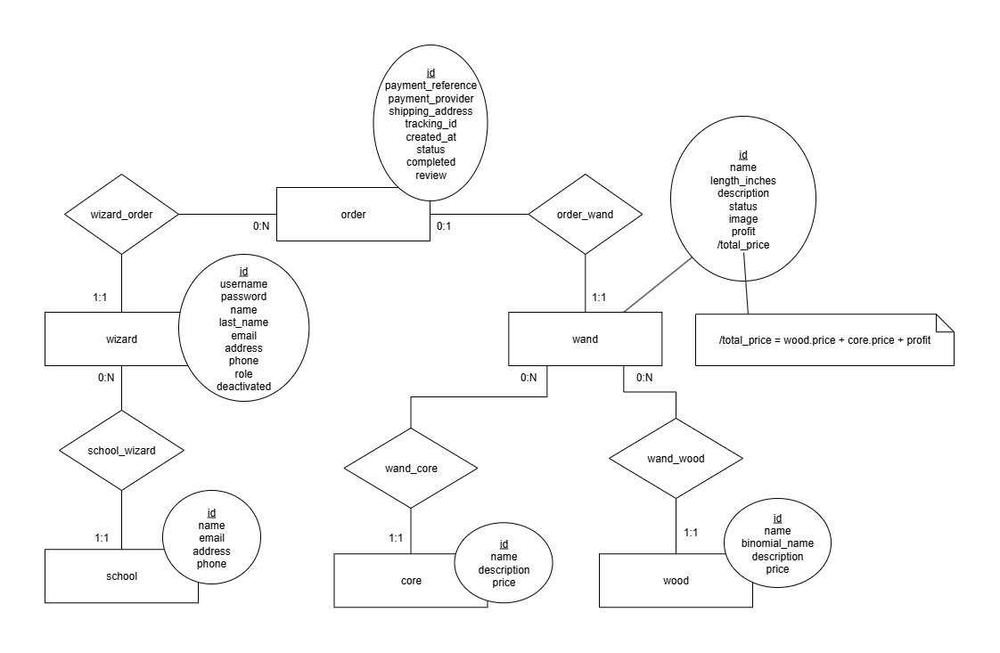

# Propuesta TP DSW

## Grupo
### Integrantes
* 46155 - Avila, Marisol
* 47868 - Silva, Alejo Lautaro

### Repositorios
* [Frontend App](https://github.com/alejosilvalau/olivenders-frontend)
* [Backend App](https://github.com/alejosilvalau/olivenders-backend)

## Tema
### Descripción
*Olivenders es una plataforma web donde los magos pueden comprar varitas mágicas de manera fácil y segura. Además, les permite reseñar sus compras para ayudar a otros magos con la elección de varita. Ya sea desde la versión de escritorio o a través del portal móvil, Olivenders te ayuda a encontrar la varita perfecta, sin importar en qué rincón del mundo mágico te encuentres.*

### Modelo

Ver diagrama en [Draw.io](https://drive.google.com/file/d/1aHBuIdu2SuQJKwL8StDEmREH56euT88r/view?usp=sharing)

**Nota:** la division de las varitas entre *madera* y *núcleo* es dada por la [wiki de Harry Potter](https://harrypotter.fandom.com/es/wiki/Varita)

## Alcance Funcional
### Alcance Mínimo
Regularidad:
|Req|Detalle|
|:-|:-|
|CRUD simple|1. CRUD **School** 2. CRUD **Core** |
|CRUD dependiente |1. CRUD **Wizard** {depende de} CRUD **School**|
|Listado + Detalle | 1. Listado de **Wands** filtrado por **Wood**, **Core**, precio y largo. Muestra imagen, nombre y precio => Detalle muestra nombre, longitud, descripción, **Wood**, **Core**|
|CUU/Epic|1. Vender una **Wand**|

Adicionales para Aprobación Directa:
|Req|Detalle|
|:-|:-|
|CRUD | 1. CRUD **Wood**   2. CRUD **Order**   3. CRUD **Wand** {depende de} CRUD **Wood** y CRUD **Core**|
|CUU/Epic |1. Reseñar compra |

Alcance Adicional Voluntario:
|Req|Detalle|
|:-|:-|
|Listado + Detalle | 1. Listado de reseñas donde se muestra fecha de compra, comentario de la reseña y usuario que realizó la compra => Detalle muestra nombre, longitud, descripción, **Wood**, **Core**.|
|CUU/Epic |1. Moderar reseñas con IA (OpenAI - ChatGPT)   2. Subir imagenes mediante una interfaz drag-and-drop a través de un servicio de Blob Storage (Cloudinary)|
